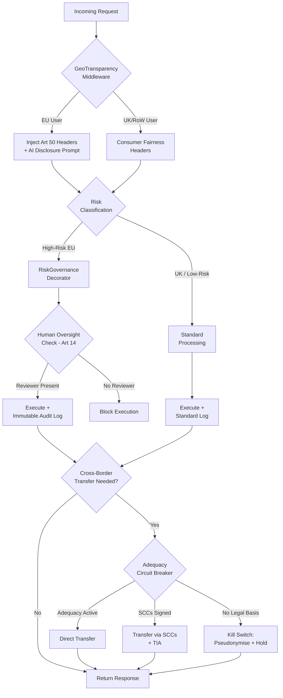

+++
title = "Architecting for Two Europes with Compliance-as-Code"
date = "2026-02-10"
draft = false
tags = ["ai", "europe", "compliance", "architecture", "regulation"]
series = ["european-ai-sovereignty"]
+++

I wrote recently about [building AI platforms under European sovereignty constraints](/posts/european-ai-sovereignty/). That post treated "Europe" as broadly singular. The reality is messier.

Arguably, there was never a single Digital Single Market for AI. The technology went mainstream after Brexit. From a British perspective, there were always two Europes. From a European one, there was the single market and then a small market that broke off. Either way, you are building for two regulatory surfaces now.

On one side, the [EU AI Act (Regulation 2024/1689)](https://eur-lex.europa.eu/eli/reg/2024/1689/oj) demands hard, ex-ante constraints on high-risk systems. On the other, the UK's [Data (Use and Access) Act 2025](https://www.legislation.gov.uk/ukpga/2025/1/contents/enacted) and its sector-led framework prioritise flexibility and "pro-innovation" principles.

For AI architects, this duality of requirements creates a real deployment problem. Compliance has become a distributed systems concern. The question is: how do you build once and deploy twice, when the two jurisdictions want fundamentally different things from your system?

This post maps the legislation to code. Specifically, I want to demonstrate how Compliance-as-Code triggers can dynamically adapt your AI system's behaviour based on jurisdiction.

---

## The Divergence: Prescriptive vs Principles-Led

The EU and UK approaches to AI regulation differ at a structural level.

The **[EU AI Act](https://eur-lex.europa.eu/eli/reg/2024/1689/oj)** operates as horizontal legislation. It enforces strict, tier-based constraints on "high-risk" systems (employment, critical infrastructure, biometrics, credit scoring). Compliance is a prerequisite for market entry. You prove conformity before deployment, not after. This is an ex-ante model.

The **UK framework**, built from the [2023 DSIT White Paper](https://www.gov.uk/government/publications/ai-regulation-a-pro-innovation-approach/white-paper) and the [AI Opportunities Action Plan](https://www.gov.uk/government/publications/ai-opportunities-action-plan), takes the opposite approach. It empowers existing regulators (ICO, FCA, CMA, Ofcom) to apply five cross-sectoral principles: Safety, Transparency, Fairness, Accountability, and Redress. Interpretation is contextual, sector by sector. This is an ex-post model.

### The Compliance Superset

If you're building a cross-border platform, you need to target the superset of both frameworks. The union of the EU's strictest technical requirements and the UK's fairness standards.

| Capability | EU AI Act (High-Risk) | UK Sectoral Constraint | Architectural Superset |
| --- | --- | --- | --- |
| **Risk Management** | Documented lifecycle ([Art. 9](https://eur-lex.europa.eu/eli/reg/2024/1689/oj)) | Sector-specific risk assessments ([DSIT White Paper](https://www.gov.uk/government/publications/ai-regulation-a-pro-innovation-approach/white-paper)) | ISO/IEC 42001-aligned lifecycle |
| **Data Governance** | Bias testing and representativeness ([Art. 10](https://eur-lex.europa.eu/eli/reg/2024/1689/oj)) | [UK GDPR](https://www.legislation.gov.uk/eur/2016/679/contents) / [Equality Act 2010](https://www.legislation.gov.uk/ukpga/2010/15/contents) | Automated bias and drift monitoring pipelines |
| **Logging** | Automatic event logging ([Art. 12](https://eur-lex.europa.eu/eli/reg/2024/1689/oj)) | Auditability for accountability ([Data Act 2025](https://www.legislation.gov.uk/ukpga/2025/1/contents/enacted)) | Immutable, tamper-proof audit trails |
| **Transparency** | Technical documentation ([Annex IV](https://eur-lex.europa.eu/eli/reg/2024/1689/oj)) | Explainability for consumers ([CPRs 2008](https://www.legislation.gov.uk/uksi/2008/1277/contents)) | Model Cards + Explainable AI (XAI) modules |

Nothing revolutionary there. The interesting part is translating these constraints into code that can adapt at runtime.

---

## Letting Users Know They're Talking to an AI

**The legal divergence**

[Article 50 of the EU AI Act](https://eur-lex.europa.eu/eli/reg/2024/1689/oj) mandates that providers of AI systems (chatbots, deepfake generators, general-purpose AI) must ensure users know they are interacting with a machine. This is a binary, strict liability requirement. If your system looks like a human, you must disclose that it is not.

The UK takes a different tack. Under the [Consumer Protection from Unfair Trading Regulations](https://www.legislation.gov.uk/uksi/2008/1277/contents) and the [Data (Use and Access) Act 2025](https://www.legislation.gov.uk/ukpga/2025/1/contents/enacted), transparency is contextual. You must not mislead the consumer, but rigid watermarking is not explicitly mandated in the same way.

**The architecture**

Treat transparency as a localised dependency. An Edge Middleware pattern lets you inject disclosure headers and modify system prompts only when the request originates from an EU IP address, preserving a lighter-touch experience for UK and rest-of-world users.

```python
from dataclasses import dataclass, field
from typing import Dict, List
import geoip2.database  # Requires MaxMind GeoLite2 database


@dataclass
class ComplianceConfig:
    eu_countries: List[str] = field(default_factory=lambda: [
        'AT', 'BE', 'BG', 'HR', 'CY', 'CZ', 'DK', 'EE', 'FI', 'FR',
        'DE', 'GR', 'HU', 'IE', 'IT', 'LV', 'LT', 'LU', 'MT', 'NL',
        'PL', 'PT', 'RO', 'SK', 'SI', 'ES', 'SE'
    ])
    mandatory_eu_header: str = "X-AI-Transparency: Automated-System-Art50"


@dataclass
class AIRequest:
    user_input: str
    ip_address: str
    system_prompt: str
    headers: Dict[str, str] = field(default_factory=dict)


class TransparencyMiddleware:
    """Edge middleware that injects EU AI Act Art 50 transparency
    disclosures for EU-origin requests, while applying lighter
    UK consumer fairness headers elsewhere."""

    def __init__(self, geo_db_path: str):
        self.reader = geoip2.database.Reader(geo_db_path)
        self.config = ComplianceConfig()

    def _get_jurisdiction(self, ip: str) -> str:
        try:
            resp = self.reader.country(ip)
            if resp.country.iso_code in self.config.eu_countries:
                return "EU"
            return "UK_ROW"
        except Exception:
            return "UK_ROW"  # Fail-open: prioritise availability

    def process(self, req: AIRequest) -> AIRequest:
        jurisdiction = self._get_jurisdiction(req.ip_address)

        if jurisdiction == "EU":
            # EU AI Act Art 50(2): mandatory disclosure
            req.system_prompt += (
                " [INSTRUCTION: Begin every response with "
                "'[AI Generated Response]']"
            )

            # Machine-readable metadata per Art 50(4) watermarking
            key, val = self.config.mandatory_eu_header.split(": ")
            req.headers[key] = val
            req.headers["X-Jurisdiction-Rule"] = "EU_2024_1689_Art50"
        else:
            # UK Data Act / CPRs: fairness-focused, no mandatory prefix
            req.headers["X-Jurisdiction-Rule"] = "UK_Consumer_Fairness"

        return req


# Usage
middleware = TransparencyMiddleware("GeoLite2-Country.mmdb")
request = AIRequest("Hello bot", "192.168.1.5", "You are a helpful assistant.")
processed = middleware.process(request)
```

The middleware inspects the GeoIP origin of each request and branches. EU users get the mandatory disclosure injected into the system prompt and machine-readable headers added to the response. UK users get a lighter "fairness" header. The model itself is unchanged. The compliance surface wraps around it.

---

## Logging Everything When the Stakes Are High

**The legal divergence**

[Article 12](https://eur-lex.europa.eu/eli/reg/2024/1689/oj) (Record Keeping) and [Article 10](https://eur-lex.europa.eu/eli/reg/2024/1689/oj) (Data Governance) of the EU AI Act require automatic recording of events and data lineage for high-risk systems. This logging must be tamper-proof. It needs to demonstrate conformity during post-market monitoring. You need an unbroken chain from training data to deployed model.

The UK's [Data (Use and Access) Act 2025](https://www.legislation.gov.uk/ukpga/2025/1/contents/enacted) takes a rather different approach. It reforms UK GDPR Article 22, allowing automated decision-making based on "legitimate interests" rather than explicit consent, provided safeguards like auditability and human review capability are in place. The logging requirement is real, but the bar is lower.

**The architecture**

A Python decorator wraps sensitive model training or inference functions. It enforces immutable logging for EU workloads, while applying lighter accountability logging for UK workloads. Crucially, for EU high-risk systems, it also enforces the human oversight requirement from [Article 14](https://eur-lex.europa.eu/eli/reg/2024/1689/oj).

```python
import functools
import hashlib
import json
import time
from dataclasses import dataclass, asdict
from enum import Enum
from typing import Optional


class RiskLevel(Enum):
    MINIMAL = "minimal"
    LIMITED = "limited"       # e.g. chatbots
    HIGH = "high"             # e.g. CV scoring, biometrics (EU Art 6)
    UNACCEPTABLE = "unacceptable"


class Jurisdiction(Enum):
    EU = "EU"
    UK = "UK"


@dataclass
class AuditLog:
    timestamp: float
    function_name: str
    risk_level: str
    jurisdiction: str
    data_hash: str
    human_oversight_id: Optional[str] = None

    def to_json(self) -> str:
        return json.dumps(asdict(self))


def enforce_governance(risk: RiskLevel, jurisdiction: Jurisdiction):
    """Decorator that enforces jurisdiction-specific logging and
    oversight constraints on model training/inference functions."""
    def decorator(func):
        @functools.wraps(func)
        def wrapper(*args, **kwargs):

            # Capture data lineage (EU Art 10)
            # Hash input arguments to prove input data integrity
            payload_str = str(args) + str(kwargs)
            data_hash = hashlib.sha256(payload_str.encode()).hexdigest()

            # EU Art 14: Human Oversight constraint for high-risk systems
            if jurisdiction == Jurisdiction.EU and risk == RiskLevel.HIGH:
                if "human_reviewer" not in kwargs:
                    raise PermissionError(
                        "BLOCKED: EU High-Risk AI requires "
                        "'human_reviewer' argument (Art 14)."
                    )

            # Execute the wrapped function
            result = func(*args, **kwargs)

            # Build the audit log entry
            log_entry = AuditLog(
                timestamp=time.time(),
                function_name=func.__name__,
                risk_level=risk.value,
                jurisdiction=jurisdiction.value,
                data_hash=data_hash,
                human_oversight_id=kwargs.get("human_reviewer"),
            )

            _write_to_audit_trail(log_entry, jurisdiction)
            return result

        return wrapper
    return decorator


def _write_to_audit_trail(log: AuditLog, jurisdiction: Jurisdiction):
    """Route audit logs to the appropriate storage backend."""
    if jurisdiction == Jurisdiction.EU:
        # Immutable storage (Article 12)
        # Production: boto3 with ObjectLockMode='GOVERNANCE'
        print(f"[IMMUTABLE-STORE] {log.to_json()}")
    else:
        # Standard accountability log (UK Data Act)
        print(f"[Standard-Log] {log.to_json()}")


# --- Usage: Credit Scoring Model ---

@enforce_governance(risk=RiskLevel.HIGH, jurisdiction=Jurisdiction.EU)
def generate_credit_score(user_data: dict, human_reviewer: Optional[str] = None):
    """High-risk EU system: requires human oversight and immutable logging."""
    return 850


# Scenario A: Fails (no human oversight for EU high-risk)
try:
    generate_credit_score({"salary": 50000})
except PermissionError as e:
    print(e)

# Scenario B: Passes (compliant)
generate_credit_score({"salary": 50000}, human_reviewer="Officer_77")
```

The decorator captures a SHA-256 hash of the input data before execution (proving what went in) and writes an immutable log after (proving what happened). For EU high-risk systems, it blocks execution entirely if no human reviewer is named. For UK systems, it still logs for accountability, but the constraints are lighter.

The thing I actually like about this pattern is that it gets out of the way. The `generate_credit_score` function is just business logic. It scores credit. The compliance concern (what to log, whether a human needs to be involved, which storage backend to write to) is a cross-cutting concern handled entirely by the decorator. Your domain code stays clean. The regulatory wrapper sits alongside it without polluting it.

---

## What Happens If Data Can't Cross the Channel

If there is one section of this post that significantly adds complexity, it's this one.

Data adequacy is the quiet mechanism that allows UK-EU data flows to operate without friction. The EU's [adequacy decision](https://commission.europa.eu/law/law-topic/data-protection/international-dimension-data-protection/adequacy-decisions_en) for the UK, renewed in January 2026, functions like an invisible API between the two jurisdictions. When it works, nobody thinks about it. When it breaks, everything downstream breaks with it.

The problem is that the current decision includes a sunset clause (2031) and a mechanism for early revocation if UK divergence threatens "essential equivalence" under [GDPR Article 45](https://eur-lex.europa.eu/eli/reg/2016/679/oj). And the UK is actively diverging. The [Data (Use and Access) Act 2025](https://www.legislation.gov.uk/ukpga/2025/1/contents/enacted) grants the Secretary of State powers to approve international transfers based on "data outcomes" rather than identical processes. It reforms automated decision-making rules in ways that move away from EU GDPR's strict consent model.

None of this means revocation is imminent. But it means the assumption that data flows freely across the Channel is load-bearing infrastructure with no redundancy. If that assumption fails, pipelines that treat the UK and EU as a single data space will suddenly require [Standard Contractual Clauses (SCCs)](https://commission.europa.eu/law/law-topic/data-protection/international-dimension-data-protection/standard-contractual-clauses-scc_en) or International Data Transfer Agreements (IDTAs) for every transfer.

### Architectural strategies for resilience

Three approaches, in order of increasing paranoia:

**Modular Data Residency.** Move from a centralised EU data hub to a data mesh architecture. Store and process EU data within the EEA and UK data within the UK. Use a federated query layer to aggregate results without moving raw PII across borders. Worth noting: federated query layers are HARD. This is a proper distributed systems problem, not a config change.

**Automated compliance triggers.** If a transfer is detected without a valid legal basis (adequacy expired, no SCCs in place), the pipeline automatically shifts to a pseudonymisation proxy or halts the flow. This feels fragile, and honestly it is. What happens when the trigger misfires? What happens when it doesn't fire at all? You are encoding legal judgment into conditional logic, and that should make you uncomfortable.

**Privacy-Enhancing Technologies.** Use federated learning to train models where the model weights travel cross-border but the personal data stays localised. The data never leaves its jurisdiction; only the learned parameters do. I have mixed feelings about this one. It is technology invented to solve a governance problem, not a user problem. No individual user is asking for federated learning. No product team has it on their roadmap because customers demanded it. It exists because regulation requires it. And meanwhile, we are competing with platforms that have zero governance overhead and can just move data wherever they like. There is something uncomfortable about pouring engineering effort into compliance machinery while your competitors are shipping features. I understand the argument at population scale. I just struggle with the weight of it when you are actually the one building the thing.

The third option is probably worth its own post. That post might also be a rant. For now, here is the circuit breaker pattern for the second:

```python
import hashlib
from dataclasses import dataclass
from typing import Any, Dict


@dataclass
class TransferPolicy:
    adequacy_active: bool
    scc_signed: bool


class DataPipeline:
    """Circuit breaker for cross-border data transfers.
    Automatically downgrades transfer mechanism if adequacy
    is revoked, or halts transfer if no legal basis exists."""

    def __init__(self, policy: TransferPolicy):
        self.policy = policy

    def transfer_to_uk(self, user_data: Dict[str, Any]) -> bool:
        dataset_id = user_data.get("id", "unknown")

        if self.policy.adequacy_active:
            print(f"Fast path: transferring {dataset_id} under adequacy.")
            return True

        if self.policy.scc_signed:
            print(f"Slow path: transferring {dataset_id} under SCCs.")
            print("  -> Transfer Impact Assessment (TIA) required.")
            return True

        # No legal basis: engage kill switch
        print(f"KILL SWITCH: no legal basis for transfer of {dataset_id}.")
        self._pseudonymise_and_hold(user_data)
        return False

    def _pseudonymise_and_hold(self, user_data: Dict[str, Any]):
        """Strip PII before any further processing (GDPR Art 4(5)).
        Data is held locally until a valid transfer mechanism exists."""
        masked = user_data.copy()
        for pii_field in ("name", "email"):
            if pii_field in masked:
                masked[pii_field] = hashlib.sha256(
                    str(masked[pii_field]).encode()
                ).hexdigest()[:16]
        print(f"  -> Pseudonymised and held: {masked}")


# Normal operation
policy = TransferPolicy(adequacy_active=True, scc_signed=False)
pipeline = DataPipeline(policy)

pipeline.transfer_to_uk({"id": 1, "name": "Alice", "email": "alice@eu.com"})

# Simulate adequacy revocation
print("\n--- EU revokes UK adequacy ---\n")
policy.adequacy_active = False

pipeline.transfer_to_uk({"id": 2, "name": "Bob", "email": "bob@eu.com"})
```

The circuit breaker queries the transfer policy on every call. If adequacy is active, data flows directly. If adequacy is revoked but SCCs are signed, it downgrades to the slower SCC path (with a Transfer Impact Assessment). If neither legal basis exists, it engages the kill switch: pseudonymise the data and hold it locally until a valid mechanism is established.

In production, the `TransferPolicy` would be backed by a configuration service or internal legal API that reflects current regulatory status. The point is that the pipeline never assumes adequacy. It checks, every time.

There is an obvious fragility here, though. You are encoding law as branching logic. The law changes slowly, which helps, but developers do not tend to check the newspaper for changes in regulation. The real dependency is organisational, not technical. Your compliance officer needs to be actively shouting at your technology officer when something shifts, and that change needs a clear path from legal update to deployed code. Without that human link, the prettiest circuit breaker in the world will be checking stale policy.

---

## How It Fits Together

These three components (transparency middleware, governance logging, and the adequacy circuit breaker) form layers of a single compliance architecture. Here is how they connect:



The request enters through the transparency middleware, which tags it by jurisdiction. The risk governance layer then enforces the appropriate logging and oversight constraints. If the processed data needs to cross the Channel, the adequacy circuit breaker validates the legal basis before any transfer occurs.

Each layer operates independently. You can deploy the transparency middleware without the logging decorator. You can use the circuit breaker without either. But together, they form a compliance surface that adapts to the jurisdiction of each individual request.

---

## References

### EU Legislation

- **[EU AI Act (Regulation (EU) 2024/1689)](https://eur-lex.europa.eu/eli/reg/2024/1689/oj)**
  - Article 9: Risk management system
  - Article 10: Data and data governance
  - Article 12: Record-keeping (logging) throughout the lifecycle
  - Article 14: Human oversight requirements
  - Article 50: Transparency obligations for providers and deployers
  - Annex IV: Technical documentation requirements

- **[GDPR (Regulation (EU) 2016/679)](https://eur-lex.europa.eu/eli/reg/2016/679/oj)**
  - Article 45: Adequacy decisions, including review and revocation mechanisms

- **[EU-UK Adequacy Decisions](https://commission.europa.eu/law/law-topic/data-protection/international-dimension-data-protection/adequacy-decisions_en)**: Renewed January 2026, with a sunset clause (2031) and mechanism for early revocation if UK divergence exceeds "essential equivalence"

- **[Standard Contractual Clauses (SCCs)](https://commission.europa.eu/law/law-topic/data-protection/international-dimension-data-protection/standard-contractual-clauses-scc_en)**: The fallback transfer mechanism if adequacy is revoked

### UK Legislation

- **[Data (Use and Access) Act 2025](https://www.legislation.gov.uk/ukpga/2025/1/contents/enacted)**
  - Reforms to UK GDPR Article 22: introduces "legitimate interests" as a basis for automated decision-making, diverging from the EU's strict consent model
  - International transfers: grants the Secretary of State powers to approve transfers based on "data outcomes"
  - Part 1 (Smart Data): establishes interoperability frameworks but diverges from EU prescriptive rules

- **[DSIT White Paper: "A pro-innovation approach to AI regulation" (2023)](https://www.gov.uk/government/publications/ai-regulation-a-pro-innovation-approach/white-paper)**: Establishes the five cross-sectoral principles (Safety, Transparency, Fairness, Accountability, Redress) and the sector-led regulatory model

- **[AI Opportunities Action Plan (2025)](https://www.gov.uk/government/publications/ai-opportunities-action-plan)**: Reinforces the sector-led approach

- **[Consumer Protection from Unfair Trading Regulations 2008](https://www.legislation.gov.uk/uksi/2008/1277/contents)**: The UK's current baseline for AI transparency obligations to consumers

- **[Equality Act 2010](https://www.legislation.gov.uk/ukpga/2010/15/contents)**: Relevant to bias and fairness requirements in UK-deployed AI systems
