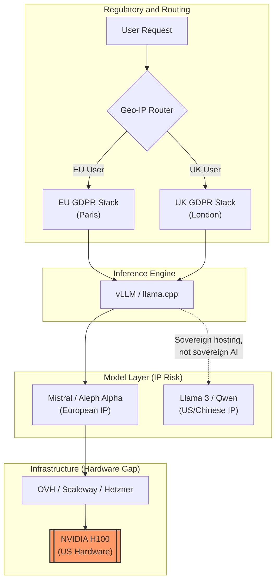

+++
title = "A Practical Guide to the European Sovereign Inference Stack"
date = "2026-02-11"
draft = false
tags = ["ai", "europe", "sovereignty", "infrastructure", "inference"]
series = ["european-ai-sovereignty"]
+++

I wrote previously about [why jurisdiction matters for European AI platforms](/posts/european-ai-sovereignty/) and then about [how to handle the UK-EU compliance split in code](/posts/compliance-as-code-two-europes/). Those posts covered the "why" and the regulatory "how." This one covers the practical "how." If you want to move away from the Big Three (AWS, GCP, Azure), whether to mitigate political risk because you distrust their sovereign cloud offerings, or to comply with [Schrems II](https://www.europarl.europa.eu/doceo/document/TA-9-2021-0026_EN.html) (the 2020 CJEU ruling that invalidated the EU-US Privacy Shield), you are entering the world of the European sovereign inference stack.

In marketing copy, "Sovereign Cloud" sounds like a digital fortress. In practice, it is a patchy landscape of high-performance compute, varying availability, and a constant battle against the NVIDIA tax. And it is worth noting that the Big Three all offer their own "sovereign cloud" products now, operated by citizens of sovereign nations with some level of contractual independence from the parent company. That muddies the water considerably. For the purposes of this post, I am running a thought experiment where we cut ourselves off from all of them entirely. No AWS Sovereign Cloud, no Azure Confidential Computing, no Google Distributed Cloud. Just European providers on European infrastructure.

To build a sovereign stack that actually works, you need to think about four layers: infrastructure, hardware, inference engine, and jurisdictional routing. I will walk through each, and be honest about where the gaps are.

---

## Who Actually Offers Sovereign Compute

Europe has a handful of champions, but they are not created equal. I have used most of these at various points and the gap between marketing and reality is worth spelling out.

| Provider | The Pitch | The Reality | Best For |
| --- | --- | --- | --- |
| **[OVHcloud](https://www.ovhcloud.com/)** | "The European Hyperscaler." Massive scale, stability. | The UI feels like 2012. Provisioning high-end GPUs (H100s) can take days or require manual tickets. | Large-scale, stable production deployments. |
| **[Scaleway](https://www.scaleway.com/)** | "The AI Cloud." Developer-first, easy K8s integration. | Stock availability is The Hunger Games. If you don't reserve instances ahead of time, you are at the mercy of the "Out of Stock" banner. | Fast-moving startups and R&D. |
| **[Hetzner](https://www.hetzner.com/)** | "Bare Metal at Scale." The cheapest cost per FLOP in Europe. | Limited managed services. No managed Kubernetes for GPUs. You are building from the OS up. | Cost-sensitive batch processing and DIY clusters. |
| **[Civo](https://www.civo.com/)** | "Cloud Native AI." Focused on ease of use and Kubernetes. | Smaller footprint. Great for L4s, but less big iron (H100s) compared to OVH. | K8s-native teams who want zero friction. |

The gap that none of them have closed: interconnect speed. None of these providers currently offer an equivalent to AWS InfiniBand performance across all nodes. If you are doing large multi-node training runs, the interconnect in EU clouds is often the bottleneck. For inference workloads this matters less, but for training it is a real constraint and worth factoring in early.

---

## Picking an Inference Engine

Sovereignty means nothing if your software is a black box. Open-source inference engines are the foundation here.

**[vLLM](https://github.com/vllm-project/vllm)** is the enterprise standard for European clouds. It uses PagedAttention to maximise throughput on server-grade GPUs (A100, H100). If you have the hardware, vLLM will squeeze the most out of it.

**[llama.cpp](https://github.com/ggerganov/llama.cpp)** is the quiet hero of the sovereign stack. Because it is written in pure C++, it can run models on hardware that vLLM cannot touch: CPU-only clusters, older Pascal or Turing GPUs, machines that are far more available in European data centres than the latest H100s. If your sovereignty requirement collides with GPU availability (and it will), llama.cpp is your fallback. A good one, too.

For a comparison of the two under different workloads, the [Red Hat Developer benchmark](https://developers.redhat.com/articles/2025/09/30/vllm-or-llamacpp-choosing-right-llm-inference-engine-your-use-case) is worth reading.

### Deploying vLLM on a European K8s Cluster

A minimal deployment targeting a Scaleway or OVH Kubernetes cluster looks like this:

```yaml
# vllm-sovereign-deploy.yaml
apiVersion: apps/v1
kind: Deployment
metadata:
  name: mistral-7b-sovereign
spec:
  replicas: 2
  selector:
    matchLabels:
      app: mistral-7b
  template:
    metadata:
      labels:
        app: mistral-7b
    spec:
      containers:
      - name: vllm-server
        image: vllm/vllm-openai:latest
        command: ["python3", "-m", "vllm.entrypoints.openai.api_server"]
        args: [
          "--model", "mistralai/Mistral-7B-Instruct-v0.3",
          "--gpu-memory-utilization", "0.95",
          "--max-model-len", "4096"
        ]
        resources:
          limits:
            nvidia.com/gpu: 1
```

And that is it. If you wanted to host your own LLM service (like the many that are out there), this is where you start. A pretty straightforward YAML document. The sovereignty guarantee comes from the cluster itself being hosted in an EU data centre, not from anything in this manifest. The YAML is portable. The jurisdiction is an infrastructure decision. If you want to build it for sovereignty, you have a lot more considerations to make (the rest of this post covers them), but the deployment itself is not the hard part.

---

## The Uncomfortable Truth About IP

Even if your data centre is in Roubaix, Falkenstein, or London, your stack almost certainly has two foreign dependencies that you cannot easily remove.

**Hardware.** You are likely running on NVIDIA chips. American chips. True hardware sovereignty (European silicon like [SiPearl](https://sipearl.com/) or [SpiNNaker2](https://spinnaker2.io/)) is still years away from production-ready LLM inference. I covered this in the [sovereignty post](/posts/european-ai-sovereignty/) and the honest answer has not changed: you can control the data layer and the policy layer, but the execution layer remains dependent on American hardware.

**Model IP.** Running Llama 3.1 (Meta, USA) or Qwen (Alibaba, China) on an OVH server gives you sovereign hosting. It does not give you sovereign AI. The weights were trained elsewhere, on data you did not curate, under legal regimes you do not control. For full sovereignty over the model itself, [Mistral](https://mistral.ai/) (France, Apache 2.0 licensed) and [Aleph Alpha](https://aleph-alpha.com/) (Germany) are the options with European provenance. Whether the capability trade-off is acceptable depends on your use case.

This is not a dealbreaker for most deployments. A frozen Mistral model running on NVIDIA hardware in a French data centre, serving inference to European users with no call home, is functionally sovereign for most practical purposes. But be honest with yourself about where the sovereignty actually stops.

---

## Routing Data Between Two GDPRs

Since Brexit, the "European" stack is split. If you serve users in both London and Paris, you are navigating two slightly different legal regimes. I covered the compliance-as-code approach in the [previous post](/posts/compliance-as-code-two-europes/), but the routing layer is worth showing separately.

**EU GDPR** enforces the One-Stop-Shop principle. If you are established in the EU, you deal with one lead supervisory authority.

**UK GDPR**, now being reshaped by the [Data (Use and Access) Act 2025](https://www.legislation.gov.uk/ukpga/2025/1/contents/enacted), introduces "stop the clock" provisions for Subject Access Requests and slightly more flexible cookie and consent rules. The divergence is gradual, but it is real, and your infrastructure needs to respect it.

The simplest approach is a jurisdictional proxy: identify user origin and route to the correct geographic inference cluster.

```python
from fastapi import FastAPI, Request, Header
import httpx

app = FastAPI()

EU_INFERENCE_URL = "https://fr-par-1.inference.sovereign.cloud"
UK_INFERENCE_URL = "https://uk-lon-1.inference.sovereign.cloud"


@app.post("/v1/chat/completions")
async def proxy_inference(
    request: Request,
    x_user_region: str = Header(None),
):
    """Route inference requests to the correct jurisdictional cluster.
    Region header is typically set by a CDN or edge proxy (e.g. Cloudflare)
    based on GeoIP lookup."""

    target_url = (
        UK_INFERENCE_URL if x_user_region == "GB"
        else EU_INFERENCE_URL
    )

    async with httpx.AsyncClient() as client:
        payload = await request.json()
        response = await client.post(
            f"{target_url}/v1/chat/completions",
            json=payload,
        )
        return response.json()
```

This is deliberately simple. The region header would typically be set upstream by a CDN or edge proxy (Cloudflare, for example) based on GeoIP. The FastAPI service just routes. EU users hit Paris. UK users hit London. The inference clusters behind each endpoint are independently deployed, with their own model weights, their own logging, and their own compliance configuration.

In practice you would add health checks, fallback logic, and proper error handling. But the core pattern is: route first, infer second. Do not let data land in the wrong jurisdiction even temporarily.

---

## How the Stack Fits Together

This diagram shows how the four layers connect. I have highlighted where American IP typically appears in an otherwise European stack, because pretending it does not exist would be dishonest.



The dotted line from the inference engine to Llama 3 / Qwen is intentional. You can use those models. Many people do. But the IP sits outside European jurisdiction, and that is a risk your organisation needs to accept explicitly rather than by default.

---

## A Checklist Before You Start

**Provider.** Scaleway for developer experience, OVHcloud for scale, Hetzner for raw cost. Reserve GPU instances ahead of time or you will not get them.

**Inference engine.** vLLM for GPU clusters. llama.cpp for CPU fallbacks or when the GPUs you can actually get are a generation or two behind.

**Model.** Mistral (Apache 2.0) keeps the weights under European legal influence. If you need capabilities that Mistral does not cover, be explicit about the sovereignty trade-off you are making.

**Compliance routing.** A geo-aware proxy ensures UK data stays on UK infrastructure and EU data stays on EU infrastructure. Do not rely on "we'll sort it out later." Route first.

---

## References

- **[Europe in the Age of AI](https://institute.global/insights/tech-and-digitalisation/europe-in-the-age-of-ai)**, Tony Blair Institute (2024). Regulatory reform and the European AI landscape.
- **[Open Source AI as a Path to Sovereignty](https://www.ri.se/en/artificial-intelligence/blogpost/open-source-ai-as-swedens-path-to-an-independent-digital-future)**, RISE Sweden. The case for open source as a sovereignty strategy.
- **[Data (Use and Access) Act 2025](https://www.gov.uk/government/collections/data-use-and-access-bill)**, UK Government. Overview of the Act and its provisions.
- **[vLLM vs llama.cpp Benchmarks](https://developers.redhat.com/articles/2025/09/30/vllm-or-llamacpp-choosing-right-llm-inference-engine-your-use-case)**, Red Hat Developer (2025). Practical comparison of inference engines for different workloads.
- **[EU AI Act (Regulation 2024/1689)](https://eur-lex.europa.eu/eli/reg/2024/1689/oj)**, EUR-Lex. The full text of the regulation.
- **[Mistral AI](https://mistral.ai/)**. European-founded model provider, Apache 2.0 licensed models.
